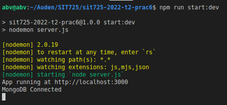
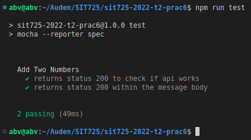

# sit725-2022-t2-prac4

This repository is for SIT725 Prac-6: [Link](https://github.com/abvitasa/sit725-2022-t2-prac6)


## Run The Application

Open project in VS Code and open terminal. Enter the following command:

```
npm install
npm run start
```

## Content



---



---

## 

---


## Progress

> | Practical | Status |
> | :-------- | ------ |
> | 1         | ✅     |
> | 2         | ✅     |
> | 3         | ✅     |
> | 4         | ✅     |
> | 5         | ✅     |
> | 6         | ✅     |

## Copyrights

This is a public project that means anyone can use this project

Copyright (c) 2022 Auden Vitasa
